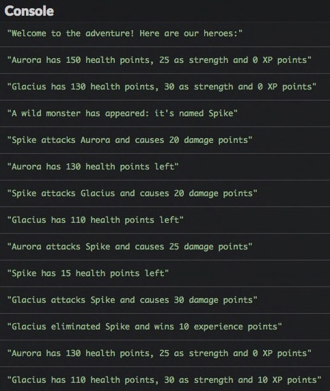
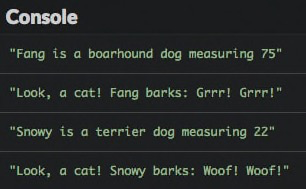
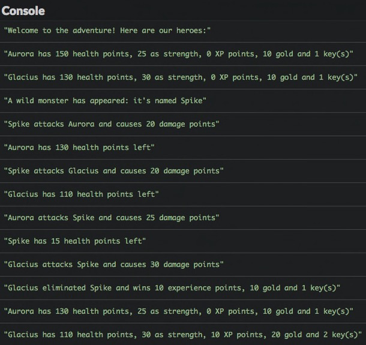
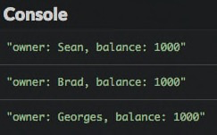

# Understand object-oriented programming

A few chapters ago, you learned how to create your first objects in JavaScript. Now it's time to better understand how to work with them.

## Context: a multiplayer RPG

As a reminder, here's the code for our minimalist RPG taken from a previous chapter. It creates an object literal named `aurora` with four properties (`name`, `health`, `strength` and `xp`) and a `describe()` method.

```js
const aurora = {
  name: "Aurora",
  health: 150,
  strength: 25,
  xp: 0,

  // Return the character description
  describe() {
    return `${this.name} has ${this.health} health points, ${this
      .strength} as strength and ${this.xp} XP points`;
  }
};

// Aurora is harmed by an arrow
aurora.health -= 20;

// Aurora gains a strength necklace
aurora.strength += 10;

// Aurora learns a new skill
aurora.xp += 15;

console.log(aurora.describe());
```

To make the game more interesting, we'd like to have more characters in it. So here comes Glacius, Aurora's fellow.

```js
const glacius = {
  name: "Glacius",
  health: 130,
  strength: 30,
  xp: 0,

  // Return the character description
  describe() {
    return `${this.name} has ${this.health} health points, ${this
      .strength} as strength and ${this.xp} XP points`;
  }
};
```

Our two characters are strikingly similar. They share the same properties, with the only difference being some property values.

You should already be aware that code duplication is dangerous and should generally be avoided. We must find a way to share what's common to our characters.

## JavaScript classes

Most object-oriented languages use classes as **abstractions** for the ideas or concepts manipulated by a program. A **class** is used to create objects representing a concept. It offers a convenient syntax to give both **data** and **behavior** to these objects.

JavaScript is no exception and supports programming with classes (but with a twist -- more on that later).

### Creating a class

Our example RPG deals with characters, so let's create a `Character` class to express what a character is.

```js
class Character {
  constructor(name, health, strength) {
    this.name = name;
    this.health = health;
    this.strength = strength;
    this.xp = 0; // XP is always zero for new characters
  }
  // Return the character description
  describe() {
    return `${this.name} has ${this.health} health points, ${this
      .strength} as strength and ${this.xp} XP points`;
  }
}
```

This example demonstrates several key facts about JavaScript classes:

* A class is created with the `class` keyword, followed by the name of the class (usually starting with an uppercase letter).
* Contrary to object literals, there is no separating punctuation between the elements inside a class.
* A class can only contain **methods**, not data properties.
* Just like with object literals, the `this` keyword is automatically set by JavaScript inside a method and represents **the object on which the method was called**.
* A special method named `constructor()` can be added to a class definition. It is called during object creation and is often used to give it data properties.

### Using a class

Once a class is defined, you can use it to create objects. Check out the rest of the program.

```js
const aurora = new Character("Aurora", 150, 25);
const glacius = new Character("Glacius", 130, 30);

// Aurora is harmed by an arrow
aurora.health -= 20;

// Aurora gains a strength necklace
aurora.strength += 10;

// Aurora learns a new skill
aurora.xp += 15;

console.log(aurora.describe());
console.log(glacius.describe());
```


The `aurora` and `glacius` objects are created as characters with the `new` operator. This statement calls the class constructor to initialize the newly created object. After creation, an object has access to the properties defined inside the class.

Here's the canonical syntax for creating an object using a class.

```js
class MyClass {
  constructor(param1, param2, ...) {
    this.property1 = param1;
    this.property2 = param2;
    // ...
  }
  method1(/* ... */) {
    // ...
  }
  method2(/* ... */) {
    // ...
  }
  // ...
}

const myObject = new MyClass(arg1, arg2, ...);
myObject.method1(/* ... */);
// ...
```

## Under the hood: objects and prototypes

If you come from another programming background, chances are you already encountered classes and feel familiar with them. But as you'll soon discover, JavaScript classes are not quite like their C++, Java or C# counterparts.

### JavaScript's object-oriented model

To create relationships between objects, JavaScript uses **prototypes**.

In addition to its own particular properties, any JavaScript object has an internal property which is a link (known as a **reference**) to another object called its **prototype**. When trying to access a property that does not exist in an object, JavaScript tries to find this property in the prototype of this object.

Here's an example (borrowed from Kyle Simpson's great book series [You Don’t Know JS](https://github.com/getify/You-Dont-Know-JS/blob/master/this%20%26%20object%20prototypes/ch5.md)).

```js
const anObject = {
  myProp: 2
};

// Create anotherObject using anObject as a prototype
const anotherObject = Object.create(anObject);

console.log(anotherObject.myProp); // 2
```

In this example, the JavaScript statement `Object.create()` is used to create the object `anotherObject` with object `anObject` as its prototype.

```js
// Create an object linked to myPrototypeObject
const myObject = Object.create(myPrototypeObject);
```

When the statement `anotherObject.myProp` is run, the `myProp` property of `anObject` is used since `myProp` doesn’t exist in `anotherObject`.

If the prototype of an object does not have a desired property, then the search continues in the object's own prototype until we get to the end of the **prototype chain**. If the end of this chain is reached without having found the property, an attempted access to the property returns the value `undefined`.

```js
const anObject = {
  myProp: 2
};

// Create anotherObject using anObject as a prototype
const anotherObject = Object.create(anObject);

// Create yetAnotherObject using anotherObject as a prototype
const yetAnotherObject = Object.create(anotherObject);

// myProp is found in yetAnotherObject's prototype chain (in anObject)
console.log(yetAnotherObject.myProp); // 2

// myOtherProp can’t be found in yetAnotherObject's prototype chain
console.log(yetAnotherObject.myOtherProp); // undefined
```

This type of relationship between JavaScript objects is called **delegation**: an object delegates part of its operation to its prototype.

### The true nature of JavaScript classes

In *class-based* object-oriented languages like C++, Java and C#, classes are static **blueprints** (templates). When an object is created, the methods and properties of the class are copied into a new entity, called an **instance**. After instantiation, the newly created object has no relation whatsoever with its class.

JavaScript's object-oriented model is based on prototypes, *not* classes, to share properties and delegate behavior between objects. In JavaScript, a class is itself an object, not a static blueprint. "Instantiating" a class creates a new object linked to a prototype object. Regarding classes behavior, the JavaScript language is quite different from C++, Java or C#, but close to other object-oriented languages like Python, Ruby and Smalltalk.

The JavaScript `class` syntax is merely a more convenient way to create relationships between objects through prototypes. Classes were introduced to emulate the class-based OOP model on top of JavaScript's own prototype-based model. It's an example of what programmers call [syntactic sugar](https://en.wikipedia.org/wiki/Syntactic_sugar).

!!! note

    The real usefulness of the `class` syntax is a pretty heated debate in the JavaScript community.

## Object-oriented programming

Now back to our RPG, which is still pretty boring. What does it lack? Monsters and fights, of course!

Following is how a fight will be handled. If attacked, a character sees their life points decrease from the strength of the attacker. If its health value falls below zero, the character is considered dead and cannot attack anymore. Its vanquisher receives a fixed number of 10 experience points.

First, let's add the capability for our characters to fight one another. Since it's a shared ability, we define it as a method named `attack()` in the `Character` class.

```js
class Character {
  constructor(name, health, strength) {
    this.name = name;
    this.health = health;
    this.strength = strength;
    this.xp = 0; // XP is always zero for new characters
  }
  // Attack a target
  attack(target) {
    if (this.health > 0) {
      const damage = this.strength;
      console.log(
        `${this.name} attacks ${target.name} and causes ${damage} damage points`
      );
      target.health -= damage;
      if (target.health > 0) {
        console.log(`${target.name} has ${target.health} health points left`);
      } else {
        target.health = 0;
        const bonusXP = 10;
        console.log(
          `${this.name} eliminated ${target.name} and wins ${bonusXP} experience points`
        );
        this.xp += bonusXP;
      }
    } else {
      console.log(`${this.name} can’t attack (they've been eliminated)`);
    }
  }
  // Return the character description
  describe() {
    return `${this.name} has ${this.health} health points, ${this
      .strength} as strength and ${this.xp} XP points`;
  }
}
```

Now we can introduce a monster in the game and make it fight our players. Here's the rest of the final code of our RPG.

```js
const aurora = new Character("Aurora", 150, 25);
const glacius = new Character("Glacius", 130, 30);

console.log("Welcome to the adventure! Here are our heroes:");
console.log(aurora.describe());
console.log(glacius.describe());

const monster = new Character("Spike", 40, 20);
console.log("A wild monster has appeared: it's named " + monster.name);

monster.attack(aurora);
monster.attack(glacius);
aurora.attack(monster);
glacius.attack(monster);

console.log(aurora.describe());
console.log(glacius.describe());
```



The previous program is a short example of **Object-Oriented Programming** (in short: OOP), a programming
[paradigm](https://en.wikipedia.org/wiki/Programming_paradigm) (a programming style) based on objects containing both data and behavior.

## TL;DR

* **Object-Oriented Programming**, or OOP, is a [programming paradigm](https://en.wikipedia.org/wiki/Programming_paradigm) that uses objects containing both **data** and **behavior** to create programs.

* A **class** is an object-oriented abstraction for an idea or a concept manipulated by a program. It offers a convenient syntax to create objects representing this concept.

* A JavaScript class is defined with the `class` keyword. It can only contain **methods**. The `constructor()` method, called during object creation, is used to initialize the object, often by giving it some data properties. Inside methods, the `this` keyword represents **the object on which the method was called**.

```js
class MyClass {
  constructor(param1, param2, ...) {
    this.property1 = param1;
    this.property2 = param2;
    // ...
  }
  method1(/* ... */) {
    // ...
  }
  method2(/* ... */) {
    // ...
  }
  // ...
}
```

* Objects are created from a class with the `new` operator. It calls the class constructor to initialize the newly created object.

```js
const myObject = new MyClass(arg1, arg2, ...);
// ...
```

* JavaScript's OOP model is based on **prototypes**. Any JavaScript object has an internal property which is a link (a **reference**) to another object: its prototype. Prototypes are used to share properties and delegate behavior between objects.

* When trying to access a property that does not exist in an object, JavaScript tries to find this property in the **prototype chain** of this object by first searching its prototype, then its prototype's own prototype, and so on.

* There are several ways to create and link JavaScript objects through prototypes. One is to use the `Object.create()` method.

```js
// Create an object linked to myPrototypeObject
const myObject = Object.create(myPrototypeObject);
```

* The JavaScript `class` syntax is another, arguably more convenient way to create relationships between objects. It emulates the class-based OOP model found in languages like C++, Java or C#. It is, however, just **syntactic sugar** on top of JavaScript's own prototype-based OOP model.

## Coding time!

### Dogs

Complete the following program to add the definition of the `Dog` class.

> Dogs taller than 60 emote `"Grrr! Grrr!"` when they bark, other ones yip `"Woof! Woof!"`.

```js
// TODO: define the Dog class here

const fang = new Dog("Fang", "boarhound", 75);
console.log(`${fang.name} is a ${fang.species} dog measuring ${fang.size}`);
console.log(`Look, a cat! ${fang.name} barks: ${fang.bark()}`);

const snowy = new Dog("Snowy", "terrier", 22);
console.log(`${snowy.name} is a ${snowy.species} dog measuring ${snowy.size}`);
console.log(`Look, a cat! ${snowy.name} barks: ${snowy.bark()}`);
```



### Character inventory

Improve the example RPG to add character inventory management according to the following rules:

* A character's inventory contains a number of gold and a number of keys.

* Each character begins with 10 gold and 1 key.

* The character description must show the inventory state.

* When a character slays another character, the victim's inventory goes to its vanquisher.

Here's the expected execution result.



### Account list

Let's build upon a previous account object exercise. A bank account is still defined by:

* A `name` property.
* A `balance` property, initially set to 0.
* A `credit` method adding the value passed as an argument to the account balance.
* A `describe` method returning the account description.

Write a program that creates three accounts: one belonging to Sean, another to Brad and the third one to Georges. These accounts are stored in an array. Next, the program credits 1000 to each account and shows its description.


